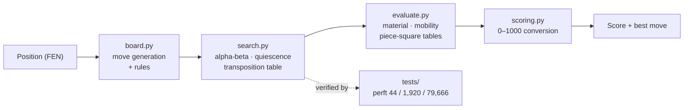
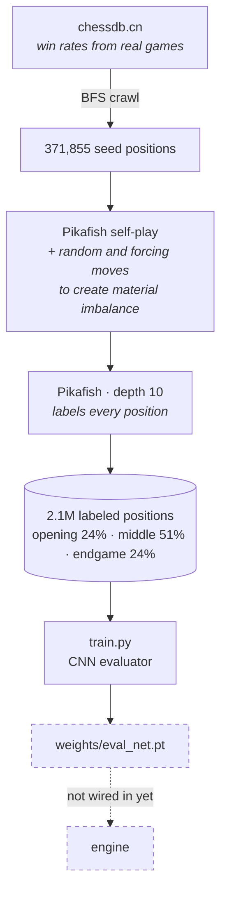
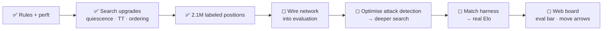

<div align="center">

# QiSheng — Xiangqi Engine v1

**棋聖** · A Xiangqi (Chinese chess) engine written from scratch in Python

*Own move generation · own search · own evaluation · no chess library of any kind*


</div>

---

## Table of Contents

- [Overview](#overview)
- [How It Works](#how-it-works)
- [The 0–1000 Scale](#the-01000-scale)
- [What It Does Well](#what-it-does-well)
- [Training Pipeline](#training-pipeline)
- [Current Limitations](#current-limitations)
- [Roadmap](#roadmap)
- [Getting Started](#getting-started)
- [Project Layout](#project-layout)
- [License](#license)

---

## Overview

QiSheng plays and analyses **Xiangqi** — Chinese chess. Every piece of game logic is
implemented from first principles: the 10×9 board, all seven piece types, the flying-general
rule, legality filtering, the search, and the evaluation. No chess library is imported
anywhere in the engine, and the engine has **zero runtime dependencies** — it runs on a
stock Python install.

Any position it is shown comes back with a single number between **0 and 1000** describing
how good the position is for Red/White, plus the move it would play.

## How It Works



Four layers, each replaceable on its own — the scale can be recalibrated without touching the
evaluation, and the evaluation can be swapped for a neural network without touching the search.

## The 0–1000 Scale

| Score | Meaning |
|---:|---|
| **1000** | mate available **in this very move** |
| 505 | the starting position (White moves first, +5 tempo) |
| 500 | dead level |
| **0** | the same, reversed, for Black |

Mate scores decay with distance (1000 → 999 → 998…), so the engine always takes the
**shortest** mate rather than any mate.

## What It Does Well

**Rules are provably correct.** Perft counts every leaf position at a given depth and compares
against Xiangqi's published reference values. A single flaw anywhere in move generation,
legality filtering, or the flying-general rule moves these numbers immediately:

```
perft(1) =     44  ✓        perft(2) =  1,920  ✓        perft(3) = 79,666  ✓
```

**It does not fall for the horizon effect.** From the opening position, White's cannon can jump
over Black's cannon and take a horse. Without quiescence search the engine scores that move
**610** — it sees the captured horse but not the recapture waiting one ply later. QiSheng
scores it **481**, its true value.

**It agrees with reference sources.** At depth 2 the engine plays the central soldier push —
the same move ranked highest by chessdb.cn from the starting position.

**Its labels are calibrated against two independent sources.** Pikafish centipawn scores and
chessdb win rates land on the same 0–1000 scale to within **21 points** on average, after
fitting the conversion constant on 500 shared positions.

## Training Pipeline



Two deliberately independent label sources, following the same reasoning as
[Qilin](https://github.com/HoangKhangCoder/Qilin-Chess-Engine-v1): engine evaluation is dense
and low-noise, while real-game win rates carry practical knowledge no engine can derive.
Training on one source alone teaches the network to imitate that source's blind spots.

| Source | Positions | What it contributes |
|---|---:|---|
| Pikafish (local, depth 10) | 2,094,986 | volume, depth, and **material-imbalanced positions** |
| chessdb.cn | 16,075 | win rates from games real people played |
| internal engine (frozen) | 37,339 | legacy set, retained for material signal |

**Why both matter — measured, not assumed.** A network trained on chessdb alone scores better
on openings (MAE 36.1 vs 53.1) yet understands material *backwards*: remove one of Black's
chariots and it believes Black improved — wrong **81%** of the time. chessdb's positions are
almost all balanced openings, so the network never sees an imbalance. Pikafish-generated data
has a score standard deviation of **383** against chessdb's ~40, with **79%** of positions
materially unbalanced.

## Current Limitations

Stated plainly, because they decide what happens next.

| Limitation | Why it matters | Status |
|---|---|---|
| **The neural evaluator is not wired into the engine** | Everything the network learned currently has zero effect on playing strength | Next up |
| **No Elo measurement exists** | Without a match harness against a reference engine, any strength claim is guesswork — so none is made | Needs match harness |
| **Search speed: depth 3 takes 13.6 s** | `is_square_attacked()` scans all 90 squares and regenerates every enemy move on each check test | Ray casting from the general's square would fix it |
| **Pure Python board representation** | Bitboards would multiply node throughput, and depth is strength | Planned |
| **No web interface** | The engine is CLI-only today | Planned |

## Roadmap



## Getting Started

The engine needs nothing but Python. `requirements.txt` (PyTorch, NumPy) is for **training only**.

```bash
python3 main.py                          # analyse the starting position
python3 main.py "<FEN>" --depth 2        # analyse any position
python3 tests/test_engine.py             # run the test suite
python3 tools/train.py --epochs 60       # retrain the evaluator
```

## Project Layout

```
engine/            engine core — pure Python, zero dependencies
  board.py           10×9 board, all 7 piece types, flying-general rule
  evaluate.py        material + mobility + placement
  pst.py             piece-square tables
  search.py          alpha-beta · quiescence · transposition table · move ordering
  scoring.py         conversion to the 0–1000 scale
tools/             offline only — never imported by the engine
  label_pikafish.py  generates and labels positions with a local Pikafish
  crawl_chessdb.py   BFS crawler over chessdb.cn's analysed tree
  train.py           trains the CNN evaluator
tests/             perft, movement rules, scoring
data/              labeled positions (JSONL)
weights/           trained network weights
web/               interactive board — not built yet
main.py            CLI analyser
```

## License

Not chosen yet. Two things to settle first: data under `data/` originates from chessdb.cn, and
Pikafish (used only to label data, never bundled or shipped) is GPL.
