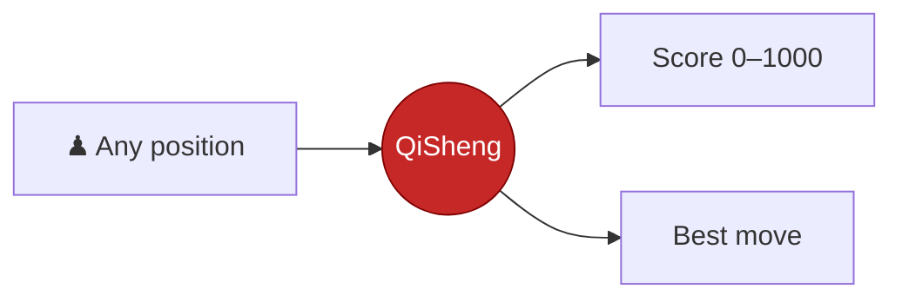
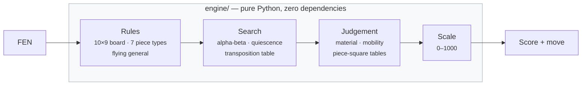
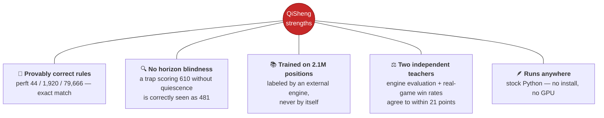
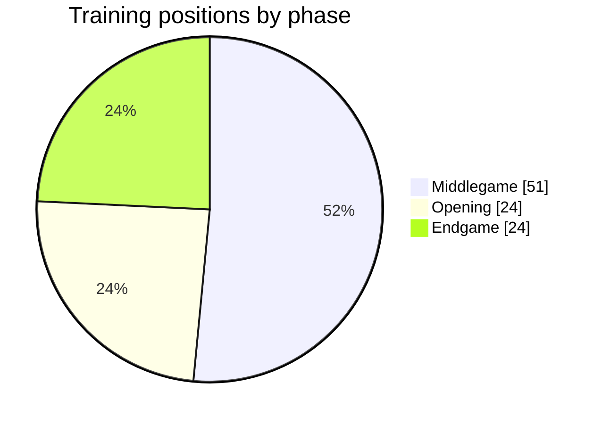
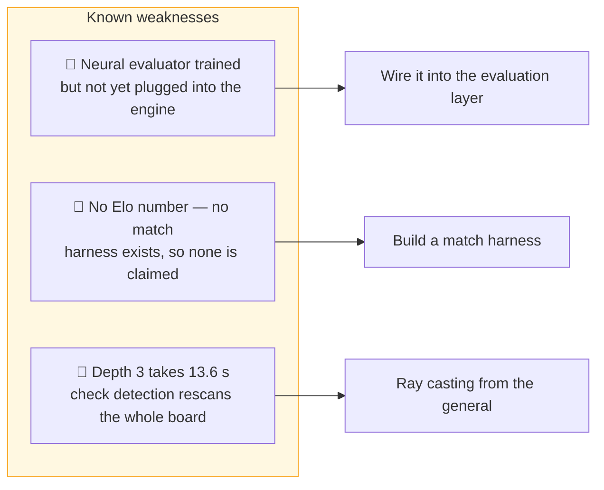
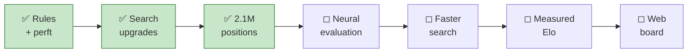

<div align="center">

# QiSheng — Xiangqi Engine v1

**棋聖**

### A Xiangqi AI built from nothing but Python

No chess library. No borrowed engine. Every rule, every search, every evaluation — written from scratch.


</div>

---

## Table of Contents

| Section | |
|---|---|
| [What It Is](#what-it-is) | The idea in 30 seconds |
| [How It Thinks](#how-it-thinks) | Architecture at a glance |
| [Strengths](#strengths) | What it already does well |
| [Under Repair](#under-repair) | Known weaknesses being worked on |
| [What's Coming](#whats-coming) | Development roadmap |
| [Try It](#try-it) | Run it yourself |

---

## What It Is

Show QiSheng any Xiangqi position. It answers with **one number from 0 to 1000** — how good
that position is for Red — and the move it would play.



| 1000 | 505 | 500 | 0 |
|:---:|:---:|:---:|:---:|
| mate **this move** | opening position | dead level | lost |

Mate scores decay with distance, so it always takes the **shortest** mate — never just *a* mate.

## How It Thinks



Four independent layers. The scale can be recalibrated without touching judgement; judgement can
be replaced by a neural network without touching search.

## Strengths



**Balanced training diet.** Positions are drawn deliberately across all three phases, and most
carry a real material imbalance — the situations where a weak evaluator gives itself away.



## Under Repair



No strength claim appears anywhere in this repository. Until games are actually played against a
reference engine, any Elo figure would be a guess — so there isn't one.

## What's Coming



The web board is the finish line: an interactive position, a live evaluation bar, and an arrow
pointing at the move QiSheng would play.

## Try It

```bash
python3 main.py                       # analyse the opening position
python3 main.py "<FEN>" --depth 2     # analyse any position
python3 tests/test_engine.py          # verify the rules yourself
```

Nothing to install — the engine runs on a stock Python interpreter.
